# Xây dựng trợ lý ảo đặt hàng và tư vấn sản phẩm theo kiến trúc Microservice

Đề tài nghiên cứu khoa học sinh viên - Mã số: **SVC2025-150**

Đề tài nghiên cứu khoa học tại Trường Đại học Sài Gòn xây dựng một trợ lý ảo cho hệ thống thương mại điện tử, trong đó Backend được phát triển theo kiến trúc Microservice và trợ lý ảo được triển khai dưới dạng AI Agent trên nền tảng N8N.


**Quy trình mua hàng**

[Xem video demo](https://quanglam.vercel.app/assets/projects/project2/video2.mp4)

**Tương tác với trợ lý ảo**

[Xem video demo](https://quanglam.vercel.app/assets/projects/project2/video1.mp4)

## Cài đặt môi trường

**1. Clone repository**

```
git clone https://github.com/lamquang4/NCKH.git
```

**2. Chạy website bằng Docker**

```
docker compose up --build
```

## Công nghệ sử dụng

| Hạng mục         | Công nghệ / Công cụ                                                       |
| ---------------- | ------------------------------------------------------------------------- |
| Frontend         | Vite + TypeScript + React 19 <br> TailwindCSS <br> Redux <br> Axios + SWR |
| Backend          | Spring Boot + Maven + Java 17 <br> Spring Security + JWT                  |
| Database         | MySQL, MongoDB, Redis                                                     |
| Monitoring       | Actuator + Prometheus + Zipkin                                            |
| Containerization | Docker                                                                    |
| Media Storage    | Cloudinary                                                                |
| CI/CD            | GitHub Actions                                                            |

## Kiến trúc hệ thống

### Frontend

Frontend được xây dựng theo mô hình Single Page Application (SPA) với React, TypeScript và build bằng Vite. Giao diện dùng TailwindCSS, responsive trên nhiều thiết bị và Redux Toolkit quản lý state toàn cục.

Sử dụng PrivateRoute để ngăn người dùng chưa đăng nhập không vào được trang cần đăng nhập và PublicRoute để cho phép người dùng vào trang không cần đăng nhập.

SWR để cache và tự động revalidate dữ liệu từ server kết hợp với Axios gọi API qua interceptor để đính JWT vào header và xử lý lỗi tập trung.

Với JWT thì token được lưu bằng js-cookie; jwt-decode được sử dụng để đọc thông tin role. Khi token hết hạn hoặc không hợp lệ, hệ thống tự động đăng xuất.

### Backend (Microservice)

Backend được xây dựng theo kiến trúc Microservice với 12 service độc lập bằng Spring Boot. Mỗi service đảm nhiệm một nghiệp vụ riêng, chạy trên port riêng và quản lý database tương ứng. Các service giao tiếp đồng bộ thông qua REST API, trong đó OpenFeign được sử dụng để thực hiện giao tiếp giữa các service.

API Gateway là điểm truy cập tập trung từ Frontend, chịu trách nhiệm tiếp nhận và định tuyến request đến service tương ứng, đồng thời xử lý CORS.

Eureka Server đóng vai trò Service Registry, quản lý thông tin đăng ký và phát hiện các service trong hệ thống. Nhờ đó, các service có thể tìm kiếm và giao tiếp với nhau thông qua tên service thay vì phải cấu hình cố định địa chỉ của từng service.

Các service áp dụng xử lý lỗi tập trung và chuẩn hóa API Response, đảm bảo cấu trúc dữ liệu trả về và thông báo lỗi thống nhất giữa các module.

Về bảo mật, mỗi service tự xác thực JWT và kiểm tra quyền truy cập. Spring Security kết hợp với @PreAuthorize được sử dụng để phân quyền theo vai trò (Role-Based Access Control), giúp bảo vệ tài nguyên tại từng service thay vì chỉ phụ thuộc vào API Gateway.

Về giám sát, mỗi service đều được tích hợp Actuator, Prometheus và Zipkin. Actuator expose các endpoint health và metrics.

| Service           | Port | Database       | Chức năng                                              |
| ----------------- | ---- | -------------- | ------------------------------------------------------ |
| api-gateway       | 8090 | -              | Định tuyến, xử lý CORS                                 |
| eureka-server     | 8761 | -              | Service registry, quản lý đăng ký và phát hiện service |
| auth-service      | 8089 | MySQL          | Xác thực người dùng, cấp phát & kiểm tra JWT token     |
| brand-service     | 8088 | MySQL          | Quản lý thương hiệu sản phẩm                           |
| assistant-service | 8087 | -              | Trung gian kết nối hệ thống với N8N                    |
| chat-service      | 8086 | MongoDB        | Lưu trữ và quản lý lịch sử hội thoại                   |
| cart-service      | 8085 | MongoDB, Redis | Quản lý giỏ hàng                                       |
| payment-service   | 8084 | MySQL          | Quản lý lịch sử giao dịch, xử lý thanh toán Momo       |
| order-service     | 8083 | MySQL          | Quản lý đơn hàng                                       |
| category-service  | 8082 | MySQL          | Quản lý danh mục sản phẩm                              |
| product-service   | 8081 | MySQL          | Quản lý sản phẩm                                       |
| user-service      | 8080 | MySQL          | Quản lý thông tin tài khoản người dùng                 |

**Các services đăng ký trên Eureka Server**

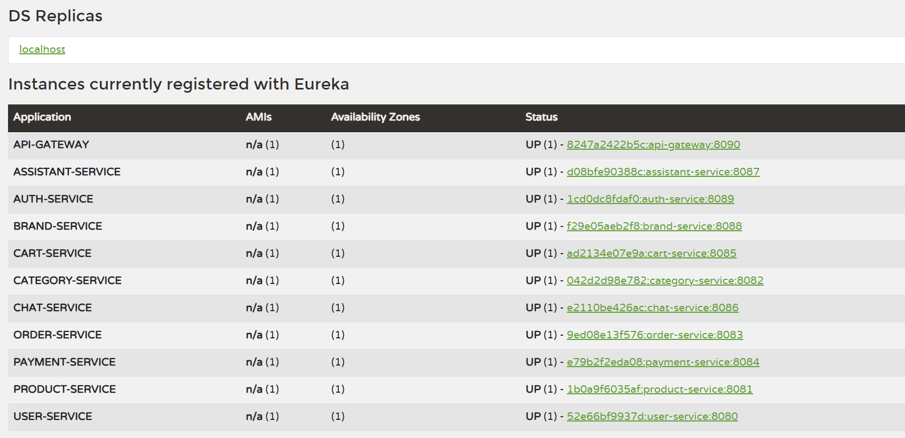

## Trợ lý ảo

Trợ lý ảo là trọng tâm của đề tài: được triển khai độc lập dưới dạng AI Agent trên nền tảng N8N, tách biệt hoàn toàn khỏi cụm Microservice và kết nối qua `assistant-service`. Trợ lý ảo sử dụng mô hình ngôn ngữ lớn Gemini 2.5 Flash để hiểu ý định người dùng bằng tiếng Việt, tự quyết định gọi tool phù hợp và thực hiện hành động nghiệp vụ thay vì chỉ trả lời hội thoại đơn thuần.

### Chức năng của trợ lý ảo

Hệ thống trợ lý ảo bao gồm hai tác nhân chính: Khách hàng và AI Agent (N8N).

- Khách hàng là người trực tiếp tương tác với hệ thống thông qua giao diện hội thoại.
- AI Agent là hệ thống xử lý ngôn ngữ tự nhiên được triển khai trên nền tảng N8N, đóng vai trò phân tích yêu cầu và điều phối các chức năng tương ứng trong hệ thống Microservice.

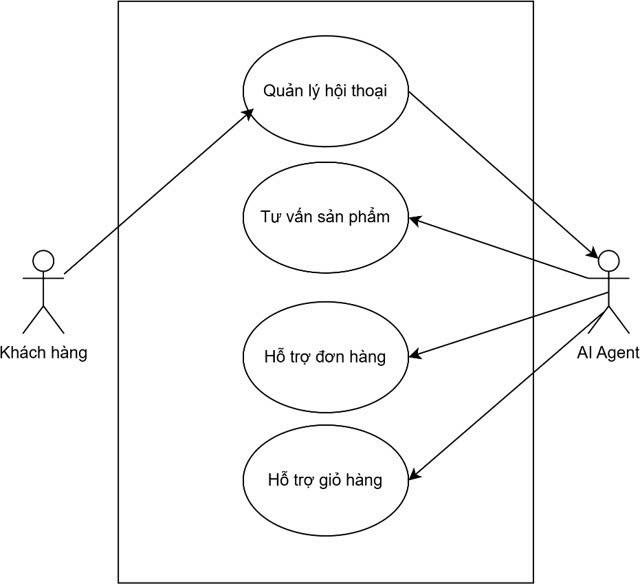

**1. Quản lý hội thoại:** Khách hàng khởi tạo tương tác bằng cách gửi tin nhắn và xem lịch sử hội thoại. AI Agent tiếp nhận tin nhắn, phân tích nội dung và sinh phản hồi phù hợp.

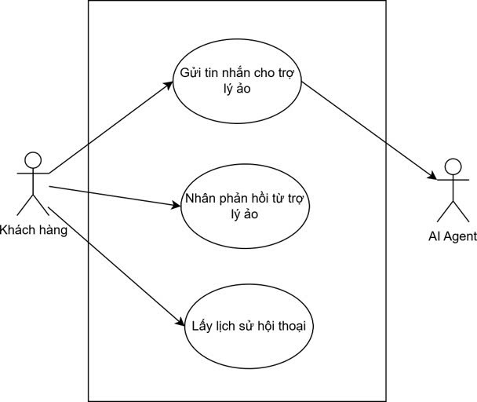

**2. Tư vấn sản phẩm:** Khách hàng gửi yêu cầu tìm kiếm, lọc hoặc gợi ý sản phẩm theo các tiêu chí như tên, danh mục, thương hiệu hoặc khoảng giá. AI Agent phân tích yêu cầu và gọi các tool tương ứng như `query_products`, `get_brands`, `get_categories`.

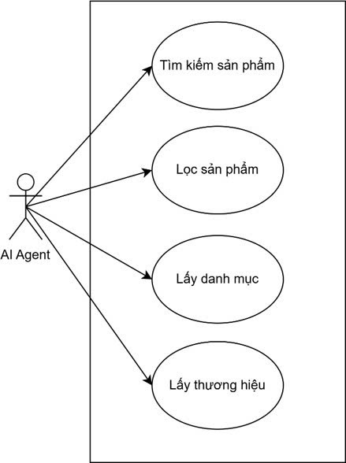

**3. Hỗ trợ giỏ hàng:** Khách hàng yêu cầu thêm sản phẩm vào giỏ hàng hoặc xem danh sách sản phẩm trong giỏ. AI Agent gọi tool `add_to_cart` hoặc `get_cart`.

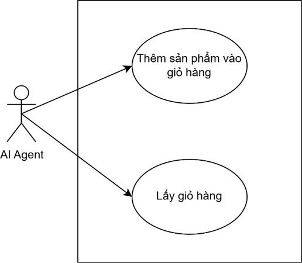

**4. Hỗ trợ đơn hàng:** Khách hàng yêu cầu tra cứu thông tin đơn hàng theo mã đơn hoặc xem danh sách đơn hàng gần nhất. AI Agent gọi tool `get_order_detail` hoặc `get_user_orders`.

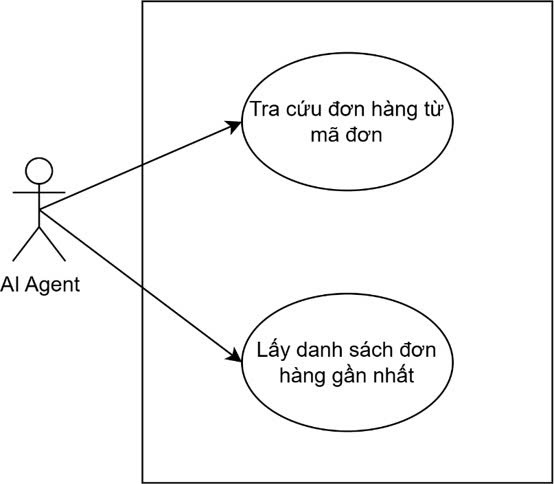

### Luồng hoạt động

Trợ lý ảo nhận tin nhắn từ người dùng kèm lịch sử hội thoại gần nhất, sau đó trả về JSON gồm nội dung phản hồi và danh sách ID sản phẩm liên quan (nếu có):

```json
{
  "content": "Nội dung phản hồi của trợ lý ảo",
  "productIds": ["id1", "id2", "id3"]
}
```

**Luồng xử lý trên N8N (5 bước):**

1. **Webhook** – tiếp nhận yêu cầu từ `assistant-service` (tin nhắn, lịch sử hội thoại, thông tin xác thực).
2. **AI Agent** – dùng Gemini 2.5 Flash phân tích yêu cầu và quyết định tool cần gọi (theo system prompt định nghĩa vai trò, rule, format output).
3. **Gọi tool** – AI Agent gọi một hoặc nhiều tool qua HTTP Request đến các Microservice.
4. **Code JavaScript** – định dạng kết quả thành JSON chuẩn (`content`, `productIds`).
5. **Respond to Webhook** – trả phản hồi về `assistant-service` để hiển thị cho người dùng.


**Danh sách các tools**

| Tool             | Phương thức | Service          | Chức năng                                                                               |
| ---------------- | ----------- | ---------------- | --------------------------------------------------------------------------------------- |
| query_products   | POST        | product-service  | Tìm kiếm, lọc sản phẩm theo tên, danh mục, thương hiệu, khoảng giá, tình trạng còn hàng |
| add_to_cart      | POST        | cart-service     | Thêm sản phẩm vào giỏ hàng                                                              |
| get_cart         | GET         | cart-service     | Lấy danh sách sản phẩm trong giỏ hàng hiện tại                                          |
| get_brands       | GET         | brand-service    | Lấy danh sách thương hiệu sản phẩm                                                      |
| get_categories   | GET         | category-service | Lấy danh sách danh mục sản phẩm                                                         |
| get_user_orders  | GET         | order-service    | Lấy lịch sử đơn hàng của người dùng                                                     |
| get_order_detail | GET         | order-service    | Tra cứu chi tiết đơn hàng theo mã đơn                                                   |

### Cơ chế cá nhân hóa trợ lý ảo

Để nâng cao chất lượng phản hồi và trải nghiệm người dùng, hệ thống trợ lý ảo áp dụng cơ chế cá nhân hóa dựa trên ba thành phần chính: Short Memory, Long Memory và Knowledge Base. Ba thành phần này giúp trợ lý ảo hiểu được ngữ cảnh hội thoại, thông tin người dùng và dữ liệu sản phẩm, từ đó đưa ra phản hồi phù hợp và chính xác hơn.

Cơ chế cá nhân hóa được triển khai theo mô hình `on-demand` trên N8N, tức là thay vì inject toàn bộ dữ liệu sẵn vào system message, AI Agent sẽ chủ động gọi các tool tương ứng khi cần thiết dựa trên hướng dẫn trong system message. Cách tiếp cận này giúp tối ưu hiệu suất xử lý, đồng thời đảm bảo dữ liệu luôn được lấy từ nguồn thực tế và cập nhật.

**Short Memory**

Lưu trữ ngữ cảnh của cuộc hội thoại hiện tại, bao gồm danh sách các tin nhắn gần nhất và nội dung tin nhắn hiện tại. Thành phần này giúp trợ lý ảo ghi nhớ nội dung đang được trao đổi, đảm bảo các phản hồi có tính liên kết và logic trong suốt cuộc hội thoại. Short Memory được lưu trữ tại `chat-service` và gửi trực tiếp lên N8N mỗi khi người dùng gửi tin nhắn, do đó AI Agent không cần gọi tool mà dữ liệu luôn có sẵn trong mỗi request.

**Long Memory**

Lưu trữ thông tin lâu dài của người dùng, phục vụ cho việc cá nhân hóa chuyên sâu. Thành phần này giúp trợ lý ảo hiểu rõ người dùng là ai, ghi nhớ hành vi và lịch sử mua hàng để áp dụng chiến lược tư vấn phù hợp. Long Memory được triển khai theo cơ chế on-demand: khi người dùng đặt câu hỏi liên quan đến cá nhân hóa như gợi ý sản phẩm hoặc tư vấn theo sở thích, system prompt hướng dẫn AI Agent chủ động gọi tool để lấy dữ liệu thực tế thay vì trả lời chung chung.

| Tool            | Nguồn dữ liệu | Mục đích                                                                                                                                                                                       |
| --------------- | ------------- | ---------------------------------------------------------------------------------------------------------------------------------------------------------------------------------------------- |
| get_user_orders | order-service | Lấy lịch sử đơn hàng gần nhất của người dùng, từ đó phân tích sản phẩm, thương hiệu, danh mục và tầm giá hay mua để làm cơ sở gọi `query_products` gợi ý sản phẩm phù hợp với từng người dùng. |

**Knowledge Base**

Là tập dữ liệu sản phẩm và hệ thống mà trợ lý ảo cần nắm để tư vấn chính xác, bao gồm thông tin sản phẩm, danh mục và thương hiệu. Tương tự Long Memory, Knowledge Base cũng hoạt động theo cơ chế on-demand: AI Agent gọi tool để truy vấn dữ liệu thực tế từ hệ thống khi người dùng hỏi về sản phẩm, danh mục hoặc thương hiệu, thay vì dựa vào thông tin tĩnh trong system message.

| Tool           | Nguồn dữ liệu    | Mục đích                         |
| -------------- | ---------------- | -------------------------------- |
| query_products | product-service  | Tìm kiếm sản phẩm theo điều kiện |
| get_brands     | brand-service    | Lấy danh sách thương hiệu        |
| get_categories | category-service | Lấy danh sách danh mục sản phẩm  |

## Thực nghiệm và đánh giá

### Đánh giá AI Agent

Nhóm xây dựng 10 test case nghiệp vụ mô phỏng các tình huống hội thoại thực tế để kiểm tra AI Agent có gọi đúng tool, đúng tham số và trả về đúng kết quả mong đợi hay không.

| Mã    | Câu hỏi                                                       | Tool mong đợi                         | Tool thực tế                          |
| ----- | ------------------------------------------------------------- | ------------------------------------- | ------------------------------------- |
| TC_1  | Cho tôi xem các mẫu laptop đang có                            | query_products                        | query_products                        |
| TC_2  | Laptop gaming dưới 20 triệu còn hàng                          | query_products                        | query_products                        |
| TC_3  | Gợi ý sản phẩm cho tôi                                        | get_user_orders, query_products       | get_user_orders, query_products       |
| TC_4  | Tôi muốn xem giỏ hàng                                         | get_cart                              | get_cart                              |
| TC_5  | Thêm 2 Ghế game E-Dra Level E – EGC229 Black Red vào giỏ hàng | query_products, add_to_cart, get_cart | query_products, add_to_cart, get_cart |
| TC_6  | Có những hãng nào?                                            | get_brands                            | get_brands                            |
| TC_7  | Có những danh mục nào?                                        | get_categories                        | get_categories                        |
| TC_8  | Cho tôi xem đơn hàng ORUD45                                   | get_order_detail                      | get_order_detail                      |
| TC_9  | Thời tiết hôm nay thế nào                                     | Không gọi tool                        | Không gọi tool                        |
| TC_10 | Xin chào bạn                                                  | Không gọi tool                        | Không gọi tool                        |

**Kết quả:** AI Agent gọi đúng tool trong 100% test case, cho thấy khả năng phân tích ý định và điều phối tool hoạt động đúng thiết kế.

**Một số test case cho AI Agent gọi tool**

**TC_10:** Khi người dùng gửi lời chào, trợ lý ảo nhận diện thông tin họ tên từ dữ liệu tài khoản và phản hồi bằng tên riêng của người dùng, tạo cảm giác gần gũi và thân thiện ngay từ đầu cuộc hội thoại.

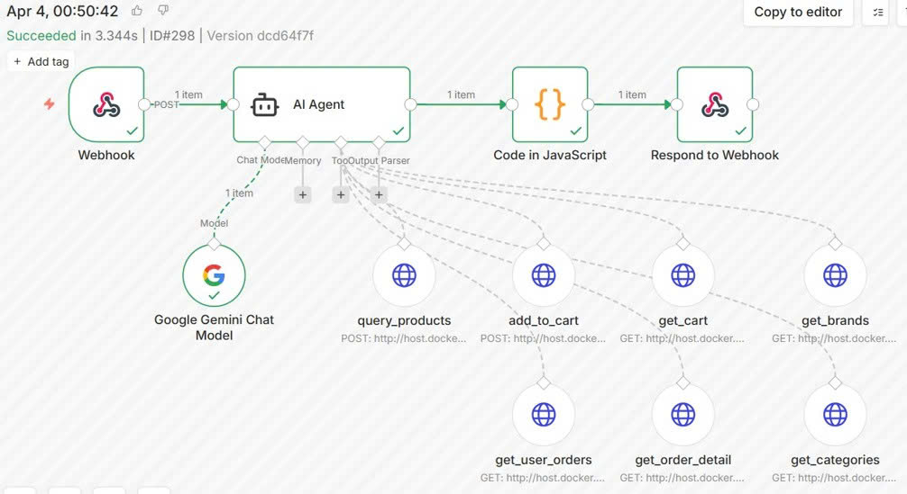

**TC_3:** Khi người dùng hỏi chung chung thì AI Agent sẽ gọi tool `get_user_orders` để phân tích lịch sử đơn hàng, xác định thương hiệu, danh mục và tầm giá người dùng hay mua, sau đó gọi `query_products` để gợi ý sản phẩm phù hợp. Với người dùng mới chưa có lịch sử, hệ thống gợi ý các sản phẩm bán chạy nhất.

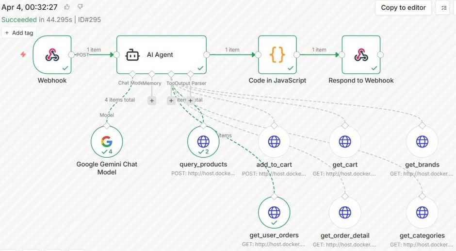

**TC_5:** Khi người dùng yêu cầu thêm sản phẩm vào giỏ hàng, AI Agent không thể gọi trực tiếp `add_to_cart` do chưa có `productId`. Vì vậy, hệ thống thực hiện gọi `query_products` để tìm sản phẩm theo tên và lấy `productId`, gọi `add_to_cart` với `productId` và số lượng. Sau khi thêm thành công, trợ lý xác nhận và hướng dẫn người dùng hoàn tất đặt hàng.

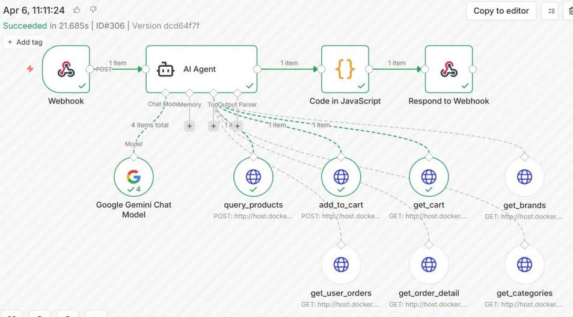

### Đánh giá mô hình ngôn ngữ

**Thực nghiệm 100 câu hỏi trên Gemini 2.5 Flash**

Nhóm thực nghiệm trực tiếp trên hệ thống với 100 câu hỏi tiếng Việt trong ngữ cảnh tư vấn mua sắm, gồm:

- Hội thoại thông thường: 10 câu
- Tư vấn sản phẩm: 35 câu
- Hỗ trợ đơn hàng: 25 câu
- Hỗ trợ giỏ hàng: 20 câu
- Ngoài phạm vi hệ thống: 10 câu

**Kết quả:** Gemini 2.5 Flash xử lý chính xác yêu cầu trong hầu hết các trường hợp, kể cả khi người dùng diễn đạt cùng một ý định bằng nhiều cách khác nhau. AI Agent xác định đúng ý định của người dùng, lựa chọn tool phù hợp khi cần truy xuất dữ liệu từ các Microservice và tạo phản hồi đúng ngữ cảnh.

**Một số câu hỏi cho mô hình ngôn ngữ phản hồi**

Câu hỏi nằm ngoài mua sắm thì kết quả cho thấy trợ lý ảo duy trì đúng vai trò tư vấn bán hàng, không bị lạc đề khi người dùng hỏi các vấn đề không liên quan đến mua sắm.

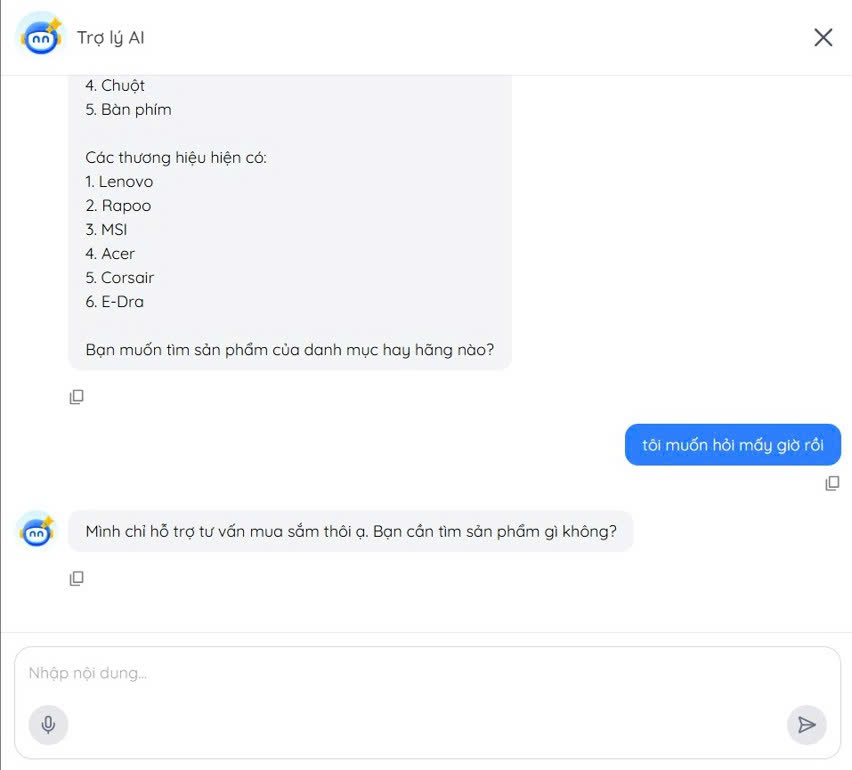

Câu hỏi chung chung thì kết quả cho thấy cơ chế cá nhân hóa hoạt động đúng với người dùng đã có lịch sử mua sắm, gợi ý sản phẩm phù hợp với thói quen và tầm giá của từng người dùng.

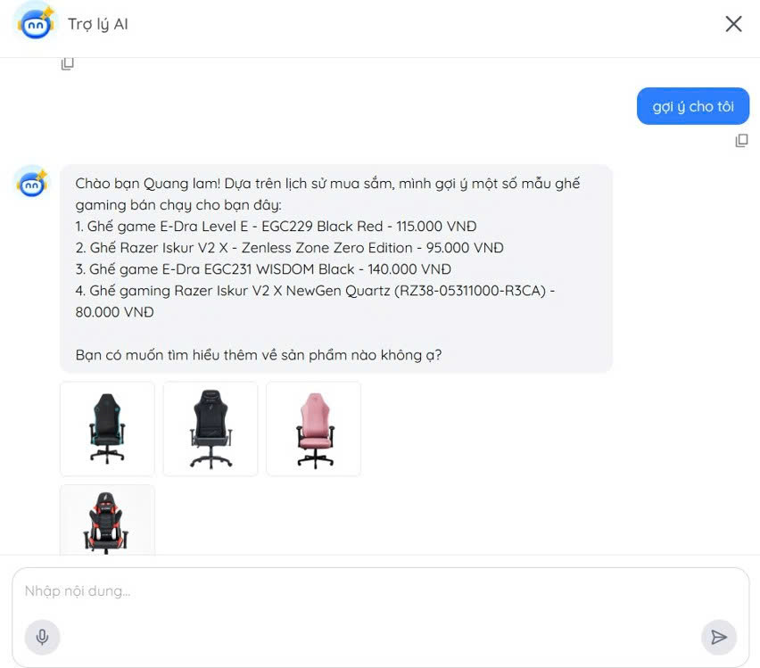

Câu hỏi thêm sản phẩm vào giỏ thì kết quả cho thấy trợ lý ảo thêm đúng sản phẩm và số lượng vào giỏ hàng, đồng thời cung cấp hướng dẫn đặt hàng cho người dùng.

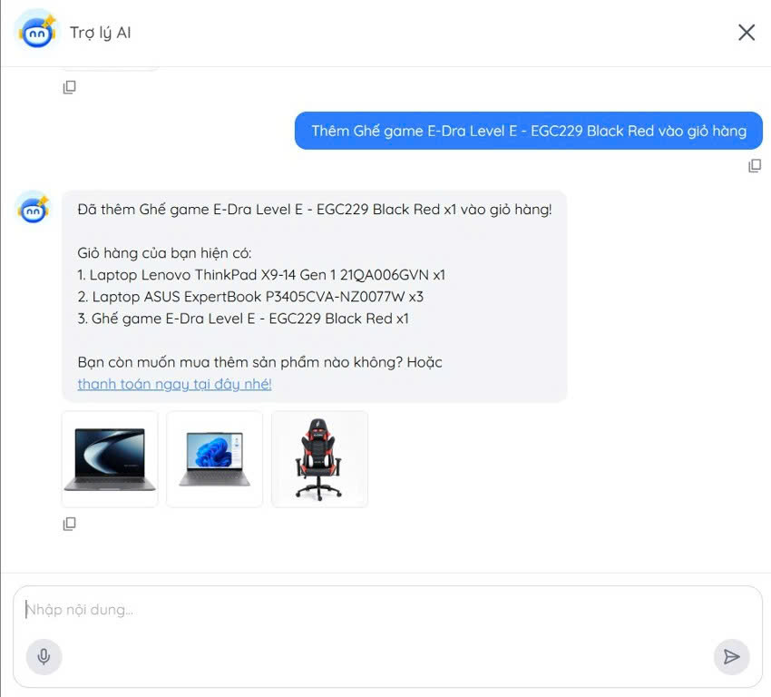

**So sánh Gemini 2.5 Flash với các mô hình khác**

Để làm cơ sở lựa chọn mô hình ngôn ngữ lớn phù hợp cho trợ lý ảo, nhóm sử dụng số liệu benchmark từ Model Card (Evals Section) của Google DeepMind cho mô hình Gemini 3 Flash (12/2025).

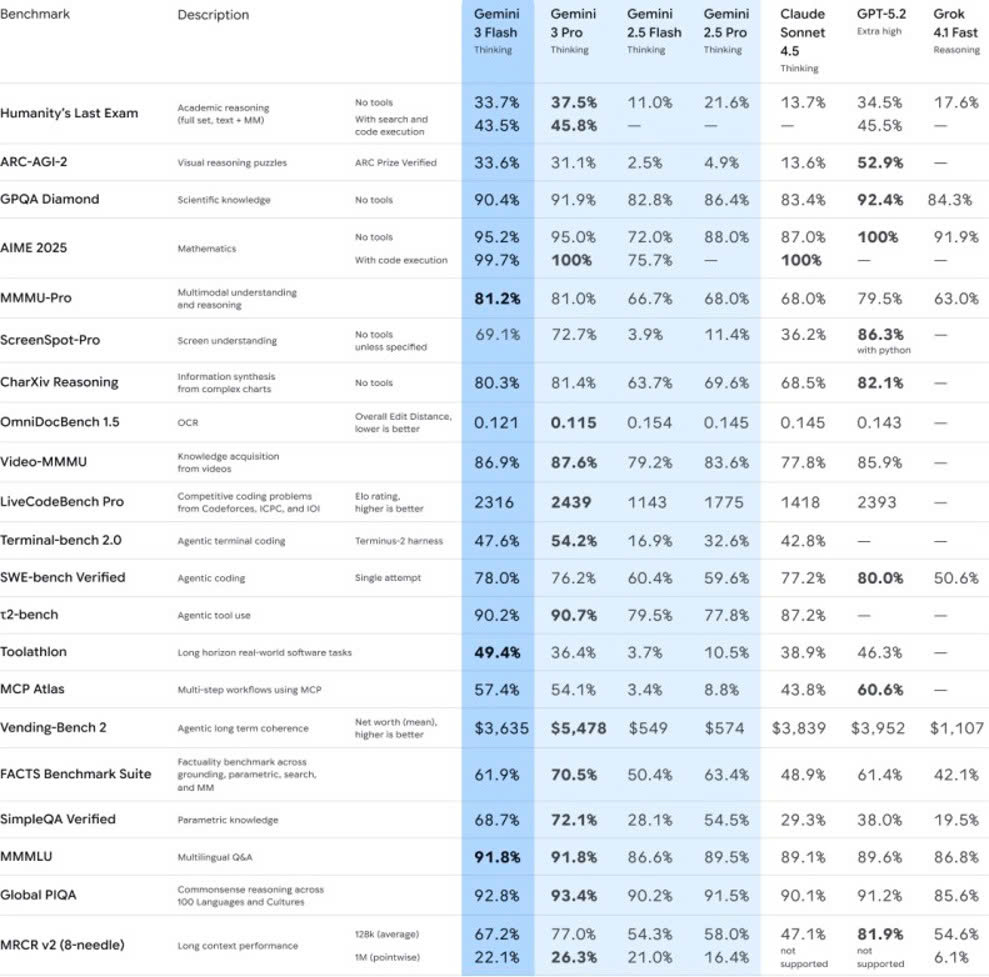

Nhóm tiến hành sử dụng số liệu từ bảng benchmark trên để phục vụ so sánh giữa các mô hình Gemini 2.5 Flash, Gemini 3 Flash, Claude Sonnet 4.5 và GPT-5.2. Các số liệu này phản ánh các năng lực cốt lõi của mô hình, bao gồm khả năng hiểu ngôn ngữ tự nhiên, suy luận và tương tác với công cụ, là những yếu tố quan trọng trong việc xây dựng hệ thống trợ lý ảo thương mại điện tử.

| Tiêu chí                    | Gemini 2.5 Flash | Gemini 3 Flash | Claude Sonnet 4.5 | GPT-5.2 |
| --------------------------- | ---------------- | -------------- | ----------------- | ------- |
| Giá input ($/1M tokens)     | $0.30            | $0.50          | $3.00             | $1.75   |
| Giá output ($/1M tokens)    | $2.50            | $3.00          | $15.00            | $14.00  |
| Đa ngôn ngữ (MMMLU)         | 86.6%            | 91.8%          | 89.1%             | 89.6%   |
| Suy luận (Global PIQA)      | 90.2%            | 92.8%          | 90.1%             | 91.2%   |
| Agentic Tool Use (τ²-bench) | 79.5%            | 90.2%          | 87.2%             | -       |
| Kiến thức (GPQA Diamond)    | 82.8%            | 90.4%          | 87.4%             | 92.4%   |

**Nhận xét:**

Gemini 2.5 Flash đạt 86.6% trên MMMLU và 90.2% trên Global PIQA, cho thấy khả năng hiểu ngôn ngữ đa lĩnh vực và xử lý các tình huống suy luận thực tế tốt. Ở các tác vụ chuyên sâu, mô hình đạt 82.8% trên GPQA Diamond và 79.5% trên τ²-bench, thấp hơn một số mô hình được so sánh.

Bù lại, Gemini 2.5 Flash có chi phí thấp nhất trong nhóm với $0.30/1M input tokens và $2.50/1M output tokens. Với kết quả thực nghiệm trên hệ thống và yêu cầu AI Agent cần xử lý nhiều tác vụ nghiệp vụ, nhóm lựa chọn Gemini 2.5 Flash do đáp ứng tốt nhu cầu hội thoại, hỗ trợ tool calling và có chi phí triển khai phù hợp.
