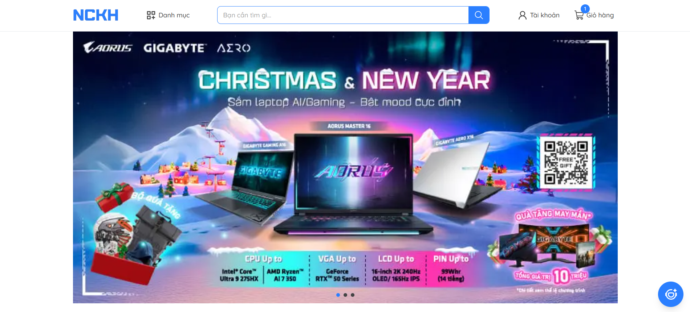
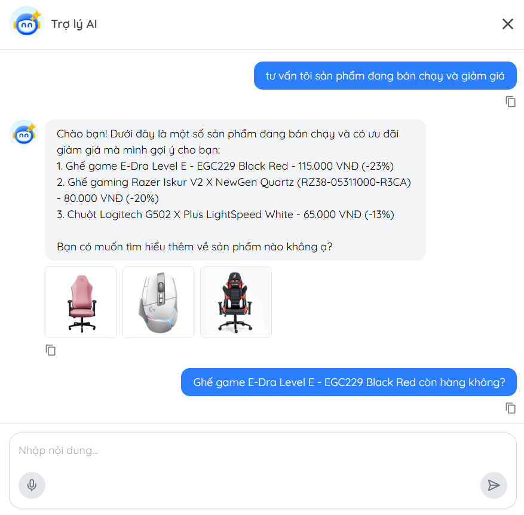
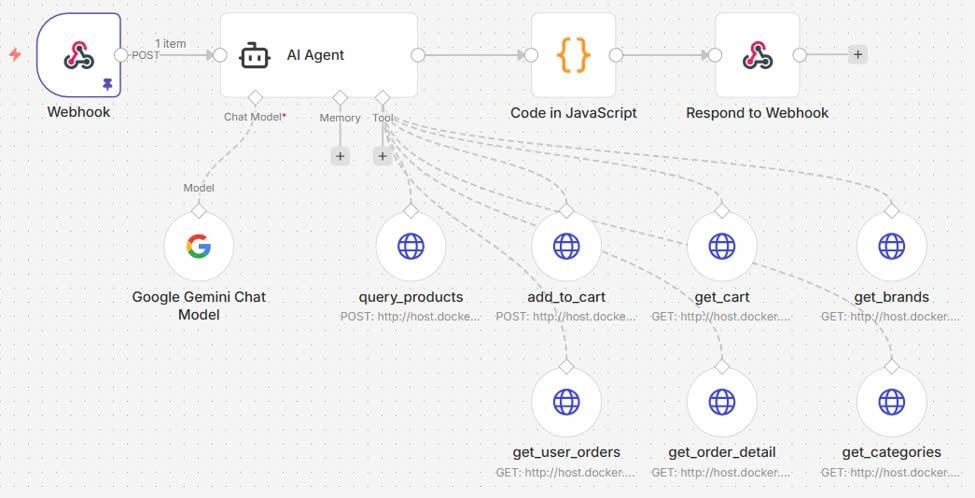

# Xây dựng trợ lý ảo đặt hàng và tư vấn sản phẩm theo kiến trúc Microservice

Đề tài nghiên cứu khoa học sinh viên - Mã số: **SVC2025-150**

Đề tài nghiên cứu khoa học tại Trường Đại học Sài Gòn xây dựng một trợ lý ảo cho hệ thống thương mại điện tử, trong đó Backend được phát triển theo kiến trúc Microservice và trợ lý ảo được triển khai dưới dạng AI Agent trên nền tảng N8N.





## Cài đặt môi trường

**1. Clone repository**

```
https://github.com/lamquang4/NCKH.git
```

**2. Chạy website bằng Docker**

```
docker compose up --build
```

## Công nghệ sử dụng

| Hạng mục         | Công nghệ / Công cụ                                                       |
| ---------------- | ------------------------------------------------------------------------- |
| Frontend         | Vite + TypeScript + React 19 <br> TailwindCSS <br> Redux <br> Axios + SWR |
| Backend          | Spring Boot + Maven + Java 17 <br> Spring Security + JWT                  |
| Containerization | Docker                                                                    |
| Database         | MySQL, MongoDB, Redis                                                     |
| Media Storage    | Cloudinary                                                                |
| Monitoring       | Actuator + Prometheus + Zipkin                                            |
| CI/CD            | GitHub Actions                                                            |

## Kiến trúc hệ thống

### Frontend

Single Page Application (SPA) component-based, xây dựng bằng React + TypeScript, build bằng Vite. Giao diện dùng TailwindCSS, responsive trên nhiều thiết bị và Redux Toolkit quản lý state toàn cục.

Sử dụng PrivateRoute để ngăn người dùng chưa đăng nhập không vào được trang cần đăng nhập và PublicRoute để cho phép người dùng vào trang không cần đăng nhập.

SWR để cache và tự động revalidate dữ liệu từ server kết hợp với Axios gọi API qua interceptor để đính JWT vào header và xử lý lỗi tập trung.

JWT lưu qua js-cookie, giải mã role bằng jwt-decode; tự động đăng xuất khi token hết hạn hoặc không hợp lệ.

### Backend (Microservice)

12 service độc lập, mỗi service chạy trên cổng riêng, tự quản lý database riêng (MySQL, MongoDB, Redis) và giao tiếp đồng bộ qua REST API bằng OpenFeign.

Mỗi service tự kiểm tra JWT verify và phân quyền theo vai trò (Role-based access controll) bằng @PreAuthorize và Spring Security.

Xử lý lỗi tập trung và chuẩn hóa API Response thống nhất cho tất cả service.

Giám sát qua Zipkin (tracing) và Prometheus (metrics).

| Service           | Port | Database       | Chức năng                                              |
| ----------------- | ---- | -------------- | ------------------------------------------------------ |
| api-gateway       | 8090 | —              | Định tuyến, xử lý CORS                                 |
| eureka-server     | 8173 | -              | Service registry, quản lý đăng ký và phát hiện service |
| auth-service      | 8089 | MySQL          | Xác thực người dùng, cấp phát & kiểm tra JWT token     |
| brand-service     | 8088 | MySQL          | Quản lý thương hiệu sản phẩm                           |
| assistant-service | 8087 | -              | Trung gian kết nối hệ thống với N8N                    |
| chat-service      | 8086 | MongoDB        | Lưu trữ và quản lý lịch sử hội thoại                   |
| cart-service      | 8085 | MongoDB, Redis | Quản lý giỏ hàng                                       |
| payment-service   | 8084 | MySQL          | Quản lý lịch sử giao dịch, xử lý thanh toán Momo       |
| order-service     | 8083 | MySQL          | Quản lý đơn hàng                                       |
| category-service  | 8082 | MySQL          | Quản lý danh mục sản phẩm                              |
| product-service   | 8081 | MySQL          | Quản lý sản phẩm                                       |
| user-service      | 8080 | MySQL          | Quản lý thông tin tài khoản người dùng                 |

### Trợ lý ảo

**Tính năng chính**

- Tư vấn, tìm kiếm sản phẩm bằng ngôn ngữ tự nhiên tiếng Việt.
- Gợi ý sản phẩm cá nhân hóa dựa trên lịch sử mua sắm (gọi tool on-demand, không inject sẵn dữ liệu vào system message).
- Xem danh mục, thương hiệu sản phẩm.
- Thêm sản phẩm vào giỏ hàng / xem giỏ hàng hiện tại.
- Tra cứu đơn hàng và chi tiết đơn hàng.
- Ghi nhớ ngữ cảnh hội thoại (Short Memory) để phản hồi liên kết, logic trong suốt phiên chat.

**Luồng hoạt động**

Trợ lý ảo nhận tin nhắn từ người dùng kèm lịch sử hội thoại gần nhất, sau đó trả về JSON gồm nội dung phản hồi và danh sách ID sản phẩm liên quan (nếu có):

```json
{
  "content": "Nội dung phản hồi của trợ lý ảo",
  "productIds": ["id1", "id2", "id3"]
}
```

**Luồng xử lý trên N8N (5 bước):**

1. **Webhook** – tiếp nhận yêu cầu từ `assistant-service` (tin nhắn, lịch sử hội thoại, thông tin xác thực).
2. **AI Agent** – dùng Gemini 2.5 Flash phân tích yêu cầu và quyết định tool cần gọi (theo system prompt định nghĩa vai trò, rule, format output).
3. **Gọi tool** – AI Agent gọi một hoặc nhiều tool qua HTTP Request đến các Microservice.
4. **Code JavaScript** – định dạng kết quả thành JSON chuẩn (`content`, `productIds`).
5. **Respond to Webhook** – trả phản hồi về `assistant-service` để hiển thị cho người dùng.



| Tool             | Phương thức | Service          | Chức năng                                                                               |
| ---------------- | ----------- | ---------------- | --------------------------------------------------------------------------------------- |
| query_products   | POST        | product-service  | Tìm kiếm, lọc sản phẩm theo tên, danh mục, thương hiệu, khoảng giá, tình trạng còn hàng |
| add_to_cart      | POST        | cart-service     | Thêm sản phẩm vào giỏ hàng                                                              |
| get_cart         | GET         | cart-service     | Lấy danh sách sản phẩm trong giỏ hàng hiện tại                                          |
| get_brands       | GET         | brand-service    | Lấy danh sách thương hiệu sản phẩm                                                      |
| get_categories   | GET         | category-service | Lấy danh sách danh mục sản phẩm                                                         |
| get_user_orders  | GET         | order-service    | Lấy lịch sử đơn hàng của người dùng                                                     |
| get_order_detail | GET         | order-service    | Tra cứu chi tiết đơn hàng theo mã đơn                                                   |
